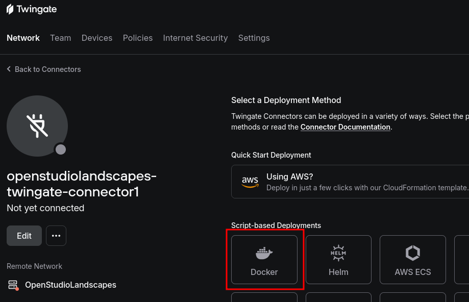
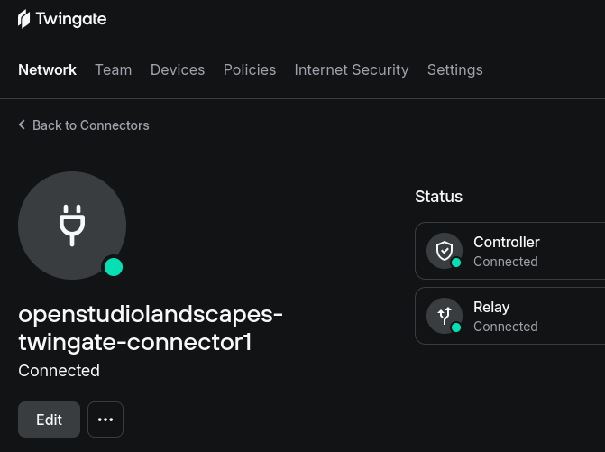

[](https://github.com/michimussato/OpenStudioLandscapes)

***

1. [Feature: OpenStudioLandscapes-Twingate](#feature-openstudiolandscapes-twingate)
   1. [Brief](#brief)
   2. [Configuration](#configuration)
2. [External Resources](#external-resources)
   1. [Twingate Connector](#twingate-connector)
      1. [Twingate Connector Setup](#twingate-connector-setup)
3. [Community](#community)
4. [Technical Reference](#technical-reference)
   1. [Requirements](#requirements)
   2. [Install](#install)
      1. [This Feature](#this-feature)
   3. [Testing](#testing)
      1. [pre-commit](#pre-commit)
      2. [nox](#nox)

***

This `README.md` was dynamically created with [OpenStudioLandscapesUtil-ReadmeGenerator](https://github.com/michimussato/OpenStudioLandscapesUtil-ReadmeGenerator).

***

# Feature: OpenStudioLandscapes-Twingate

## Brief

This is an extension to the OpenStudioLandscapes ecosystem. The full documentation of OpenStudioLandscapes is available [here](https://github.com/michimussato/OpenStudioLandscapes).

> [!NOTE]
> 
> You feel like writing your own Feature? Go and check out the 
> [OpenStudioLandscapes-Template](https://github.com/michimussato/OpenStudioLandscapes-Template).

## Configuration

OpenStudioLandscapes will search for a local config store. The default location is `~/.config/OpenStudioLandscapes/config-store/` but you can specify a different location if you need to.

A local config store location will be created if it doesn't exist, together with the `config.yml` files for each individual Feature.

> [!TIP]
> 
> The config store root will be initialized as a local Git
> controlled repository. This makes it easy to track changes
> you made to the `config.yml`.

> [!TIP]
> 
> To specify a config store location different than
> the default, you can do so be setting the environment variable
> `OPENSTUDIOLANDSCAPES__CONFIGSTORE_ROOT`:
> 
> ```shell
> OPENSTUDIOLANDSCAPES__CONFIGSTORE_ROOT="~/.config/OpenStudioLandscapes/my-custom-config-store"
> ```

The following settings are available in `OpenStudioLandscapes-Twingate` and are based on [`OpenStudioLandscapes-Twingate/tree/main/OpenStudioLandscapes/Twingate/config/models.py`](https://github.com/michimussato/OpenStudioLandscapes-Twingate/tree/main/OpenStudioLandscapes/Twingate/config/models.py).

```yaml
# ===
# env
# ---
#
# Type: typing.Dict
# Base Class Info:
#     Required:
#         False
#     Description:
#         None
#     Default value:
#         None
# Description:
#     None
# Required:
#     False
# Examples:
#     None


# =============
# config_engine
# -------------
#
# Type: <class 'OpenStudioLandscapes.engine.config.models.ConfigEngine'>
# Base Class Info:
#     Required:
#         False
#     Description:
#         None
#     Default value:
#         None
# Description:
#     None
# Required:
#     False
# Examples:
#     None


# =============
# config_parent
# -------------
#
# Type: <class 'OpenStudioLandscapes.engine.config.models.FeatureBaseModel'>
# Base Class Info:
#     Required:
#         False
#     Description:
#         None
#     Default value:
#         None
# Description:
#     None
# Required:
#     False
# Examples:
#     None


# ============
# distribution
# ------------
#
# Type: <class 'importlib.metadata.Distribution'>
# Base Class Info:
#     Required:
#         False
#     Description:
#         None
#     Default value:
#         None
# Description:
#     None
# Required:
#     False
# Examples:
#     None


# ==========
# group_name
# ----------
#
# Type: <class 'str'>
# Base Class Info:
#     Required:
#         False
#     Description:
#         None
#     Default value:
#         None
# Description:
#     None
# Required:
#     False
# Examples:
#     None


# ============
# key_prefixes
# ------------
#
# Type: typing.List[str]
# Base Class Info:
#     Required:
#         False
#     Description:
#         None
#     Default value:
#         None
# Description:
#     None
# Required:
#     False
# Examples:
#     None


# =======
# enabled
# -------
#
# Type: <class 'bool'>
# Base Class Info:
#     Required:
#         False
#     Description:
#         Whether the Feature is enabled or not.
#     Default value:
#         True
# Description:
#     Not enabled by default because this Feature is mostly obsolete (replaced by Pangolin)
# Required:
#     False
# Examples:
#     None
enabled: false


# =============
# compose_scope
# -------------
#
# Type: <class 'str'>
# Base Class Info:
#     Required:
#         False
#     Description:
#         None
#     Default value:
#         default
# Description:
#     None
# Required:
#     False
# Examples:
#     ['default', 'license_server', 'worker']


# ============
# feature_name
# ------------
#
# Type: <class 'str'>
# Base Class Info:
#     Required:
#         True
#     Description:
#         The name of the feature. It is derived from the `OpenStudioLandscapes.<Feature>.dist` attribute.
#     Default value:
#         PydanticUndefined
# Description:
#     None
# Required:
#     False
# Examples:
#     None
feature_name: OpenStudioLandscapes-Twingate


# ==============
# docker_compose
# --------------
#
# Type: <class 'pathlib.Path'>
# Base Class Info:
#     Required:
#         False
#     Description:
#         The path to the `docker-compose.yml` file.
#     Default value:
#         {DOT_LANDSCAPES}/{LANDSCAPE}/{FEATURE}/docker_compose/docker-compose.yml
# Description:
#     The path to the `docker-compose.yml` file.
# Required:
#     False
# Examples:
#     None


# ============
# docker_image
# ------------
#
# Type: <class 'str'>
# Description:
#     None
# Required:
#     False
# Examples:
#     None
docker_image: docker.io/twingate/connector:latest


# ==========================
# TWINGATE_LABEL_DEPLOYED_BY
# --------------------------
#
# Type: <class 'str'>
# Description:
#     None
# Required:
#     False
# Examples:
#     None
TWINGATE_LABEL_DEPLOYED_BY: docker


# ================
# TWINGATE_NETWORK
# ----------------
#
# Type: <class 'str'>
# Description:
#     Set this value in `.env` (`OPENSTUDIOLANDSCAPES_TWINGATE__TWINGATE_NETWORK`).
# Required:
#     False
# Examples:
#     None
TWINGATE_NETWORK: ''


# =====================
# TWINGATE_ACCESS_TOKEN
# ---------------------
#
# Type: <class 'str'>
# Description:
#     Set this value in `.env` (`OPENSTUDIOLANDSCAPES_TWINGATE__TWINGATE_ACCESS_TOKEN`).
# Required:
#     False
# Examples:
#     None
TWINGATE_ACCESS_TOKEN: ''


# ======================
# TWINGATE_REFRESH_TOKEN
# ----------------------
#
# Type: <class 'str'>
# Description:
#     Set this value in `.env` (`OPENSTUDIOLANDSCAPES_TWINGATE__TWINGATE_REFRESH_TOKEN`).
# Required:
#     False
# Examples:
#     None
TWINGATE_REFRESH_TOKEN: ''


# ======================
# TWINGATE_LOG_ANALYTICS
# ----------------------
#
# Type: <class 'str'>
# Description:
#     None
# Required:
#     False
# Examples:
#     None
TWINGATE_LOG_ANALYTICS: v2


# ==================
# TWINGATE_LOG_LEVEL
# ------------------
#
# Type: <class 'int'>
# Description:
#     None
# Required:
#     False
# Examples:
#     None
TWINGATE_LOG_LEVEL: 3


```

***

# External Resources

[](https://www.twingate.com/)

## Twingate Connector

Twingate Information:

- [Github](https://github.com/Twingate-Labs)
- [Twingate on Docker Hub](https://hub.docker.com/u/twingate)
- [Twingate Connector (Docker Hub)](https://hub.docker.com/r/twingate/connector)
- [How to deploy a Connector](https://www.twingate.com/docs/quick-start#deploy-a-connector)
- [Documentation](https://www.twingate.com/docs/)
- [Twingate API](https://www.twingate.com/docs/api-overview)
- [Deploy Docker Compose](https://www.twingate.com/docs/deploy-connector-with-docker-compose)
- [Documentation](https://rustdesk.com/docs/en/self-host/rustdesk-server-oss/docker/)
- [Tutorial/Overview (Network Chuck)](https://www.youtube.com/watch?v=IYmXPF3XUwo&ab_channel=NetworkChuck)

### Twingate Connector Setup

#### Sign Up

- [https://auth.twingate.com/signup-v2](https://auth.twingate.com/signup-v2)

#### Add Remote Network

- [https://openstudiolandscapes.twingate.com/networks](https://openstudiolandscapes.twingate.com/networks)

1. On Premise
2. Set Remote Network name
3. Add Remote Network name to `.env` (`OPENSTUDIOLANDSCAPES_TWINGATE__TWINGATE_NETWORK`)

#### Add Connector

For redundancy, Twingate sets up two Connectors. We'll continue with one for now.

- [https://openstudiolandscapes.twingate.com/connectors](https://openstudiolandscapes.twingate.com/connectors)

1. Docker
2. Generate New Tokens
3. Add Access Token to `.env` (`OPENSTUDIOLANDSCAPES_TWINGATE__TWINGATE_ACCESS_TOKEN`)
4. Add Refresh Token to `.env` (`OPENSTUDIOLANDSCAPES_TWINGATE__TWINGATE_REFRESH_TOKEN`)



#### Create and Launch Landscape (OpenStudioLandscapes-Twingate)

```generic
[...]
twingate--2025-09-09-09-50-23-9369549baddf4d81b9e37d9fed4ca5ce  | State: Offline
twingate--2025-09-09-09-50-23-9369549baddf4d81b9e37d9fed4ca5ce  | State: Authentication
twingate--2025-09-09-09-50-23-9369549baddf4d81b9e37d9fed4ca5ce  | State: Authentication
twingate--2025-09-09-09-50-23-9369549baddf4d81b9e37d9fed4ca5ce  | State: Online
[...]
```



***

# Community

| Feature                              | GitHub                                                                                                                                       | Discord                                                                 |
| ------------------------------------ | -------------------------------------------------------------------------------------------------------------------------------------------- | ----------------------------------------------------------------------- |
| OpenStudioLandscapes                 | [https://github.com/michimussato/OpenStudioLandscapes](https://github.com/michimussato/OpenStudioLandscapes)                                 | [# openstudiolandscapes-general](https://discord.gg/F6bDRWsHac)         |
| OpenStudioLandscapes-Ayon            | [https://github.com/michimussato/OpenStudioLandscapes-Ayon](https://github.com/michimussato/OpenStudioLandscapes-Ayon)                       | [# openstudiolandscapes-ayon](https://discord.gg/gd6etWAF3v)            |
| OpenStudioLandscapes-Dagster         | [https://github.com/michimussato/OpenStudioLandscapes-Dagster](https://github.com/michimussato/OpenStudioLandscapes-Dagster)                 | [# openstudiolandscapes-dagster](https://discord.gg/jwB3DwmKvs)         |
| OpenStudioLandscapes-Flamenco        | [https://github.com/michimussato/OpenStudioLandscapes-Flamenco](https://github.com/michimussato/OpenStudioLandscapes-Flamenco)               | [# openstudiolandscapes-flamenco](https://discord.gg/EPrX5fzBCf)        |
| OpenStudioLandscapes-Flamenco-Worker | [https://github.com/michimussato/OpenStudioLandscapes-Flamenco-Worker](https://github.com/michimussato/OpenStudioLandscapes-Flamenco-Worker) | [# openstudiolandscapes-flamenco-worker](https://discord.gg/Sa2zFqSc4p) |
| OpenStudioLandscapes-Kitsu           | [https://github.com/michimussato/OpenStudioLandscapes-Kitsu](https://github.com/michimussato/OpenStudioLandscapes-Kitsu)                     | [# openstudiolandscapes-kitsu](https://discord.gg/6cc6mkReJ7)           |
| OpenStudioLandscapes-RustDeskServer  | [https://github.com/michimussato/OpenStudioLandscapes-RustDeskServer](https://github.com/michimussato/OpenStudioLandscapes-RustDeskServer)   | [# openstudiolandscapes-rustdeskserver](https://discord.gg/nJ8Ffd2xY3)  |
| OpenStudioLandscapes-Template        | [https://github.com/michimussato/OpenStudioLandscapes-Template](https://github.com/michimussato/OpenStudioLandscapes-Template)               | [# openstudiolandscapes-template](https://discord.gg/J59GYp3Wpy)        |
| OpenStudioLandscapes-VERT            | [https://github.com/michimussato/OpenStudioLandscapes-VERT](https://github.com/michimussato/OpenStudioLandscapes-VERT)                       | [# openstudiolandscapes-twingate](https://discord.gg/FYaFRUwbYr)        |

To follow up on the previous LinkedIn publications, visit:

- [OpenStudioLandscapes on LinkedIn](https://www.linkedin.com/company/106731439/).
- [Search for tag #OpenStudioLandscapes on LinkedIn](https://www.linkedin.com/search/results/all/?keywords=%23openstudiolandscapes).

***

# Technical Reference

## Requirements

- `python-3.11`
- `OpenStudioLandscapes`

## Install

### This Feature

Clone this repository into `OpenStudioLandscapes/.features`:

```shell
# cd .features
git clone https://github.com/michimussato/OpenStudioLandscapes-Twingate.git
```

Create `venv`:

```shell
# cd .features/OpenStudioLandscapes-Twingate
python3.11 -m venv .venv
source .venv/bin/activate
python -m pip install --upgrade pip setuptools
```

Configure `venv`:

```shell
# cd .features/OpenStudioLandscapes-Twingate
pip install -e "../../[dev]"
pip install -e ".[dev]"
```

For more info see [VCS Support of pip](https://pip.pypa.io/en/stable/topics/vcs-support/).

## Testing

### pre-commit

- https://pre-commit.com
- https://pre-commit.com/hooks.html

```shell
pre-commit install
```

### nox

#### Generate Report

```shell
nox --no-error-on-missing-interpreters --report .nox/nox-report.json
```

#### Re-Generate this README

```shell
nox -v --add-timestamp --session readme
```

#### pylint

```shell
nox -v --add-timestamp --session lint
```

##### pylint: disable=redefined-outer-name

- [`W0621`](https://pylint.pycqa.org/en/latest/user_guide/messages/warning/redefined-outer-name.html): Due to Dagsters way of piping arguments into assets.

#### SBOM

Acronym for Software Bill of Materials

```shell
nox -v --add-timestamp --session sbom
```

We create the following SBOMs:

- [`cyclonedx-bom`](https://pypi.org/project/cyclonedx-bom/)
- [`pipdeptree`](https://pypi.org/project/pipdeptree/) (Dot)
- [`pipdeptree`](https://pypi.org/project/pipdeptree/) (Mermaid)

SBOMs for the different Python interpreters defined in [`.noxfile.VERSIONS`](https://github.com/michimussato/OpenStudioLandscapes-Twingate/tree/main/noxfile.py) will be created in the [`.sbom`](https://github.com/michimussato/OpenStudioLandscapes-Twingate/tree/main/.sbom) directory of this repository.

- `cyclone-dx`
- `pipdeptree` (Dot)
- `pipdeptree` (Mermaid)

Currently, the following Python interpreters are enabled for testing:

- `python3.11`

***

Last changed: **2025-12-23 13:35:05 UTC**